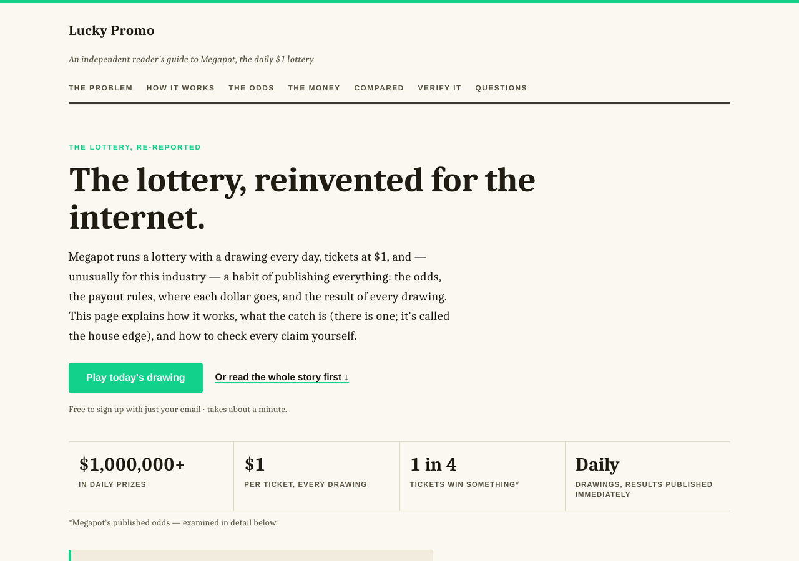
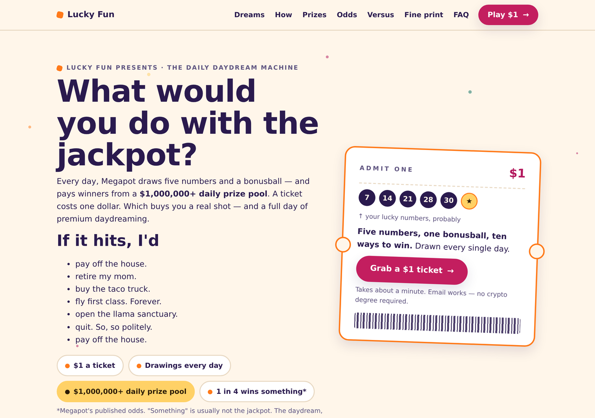
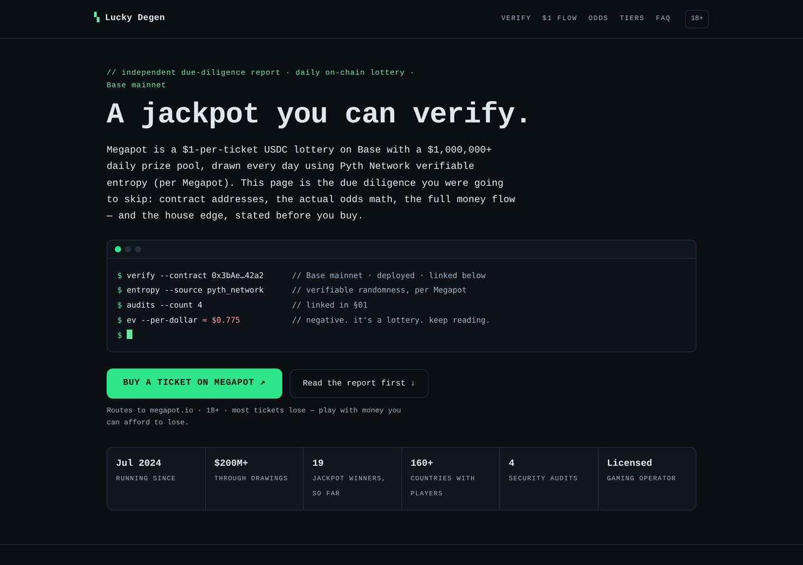

# megapot-templates

Free, open-source landing-page templates for Megapot referral sites —
the template library behind [megapot.build](https://megapot.build).

Each template is a **single self-contained HTML file**: no build step, no dependencies, no
tracking. Fill in a handful of placeholders (or let megapot.build do it for you), drop it on
any static host, and you have a full, content-rich landing page that sends visitors to Megapot
through **your** invite link — not a paragraph and a button, a real scroll experience with the
odds, the money flow, and the receipts to back it up.

## Templates

<table>
<tr>
<td width="25%" valign="top">

**[Formal](templates/formal/)**
*An independent reader's guide*

General web audience. Editorial, sourced, zero crypto vocabulary. Sells trust.

</td>
<td width="25%" valign="top">

**[Fun](templates/fun/)**
*The daily daydream machine*

Everyday dreamers. Playful, colorful, game-show energy. Sells the feeling of the win.

</td>
<td width="25%" valign="top">

**[Degen](templates/degen/)**
*A jackpot you can verify*

Crypto natives. Terminal-styled due-diligence report. Sells radical transparency.

</td>
<td width="25%" valign="top">

**[Daily](templates/daily/)**
*A new drawing, every single day*

Habit-driven audiences. Warm, rounded, planner-page UI. Sells the daily cadence, not the jackpot.
*(screenshots pending)*

</td>
</tr>
</table>

Each template README has the full picture: light + dark screenshots, a full-page scroll
capture, and a section-by-section breakdown of what's actually on the page and why.

All templates:

- are a genuine **scroll experience** — 6–9 substantive sections, several calls to action, all
  content sourced from Megapot's own published documentation (prize structure, odds mechanics,
  the money flow) and attributed as such
- auto-detect **light/dark** via `prefers-color-scheme`, verified WCAG 2.1 AA in both schemes
  (contrast, focus rings, tap targets)
- make **no network calls** and set no cookies (an optional first-party click beacon can be
  injected by the generator, off by default) — and ship with **zero JavaScript**
- carry a **responsible-play disclaimer slot** and an independence note ("not affiliated with
  Megapot")

## Placeholder contract

A template is any HTML file that fills these tokens:

| Token | Meaning |
|---|---|
| `{{SITE_NAME}}` | Operator's site name (HTML-escaped by the generator) |
| `{{TAGLINE}}` | Headline / h1 (HTML-escaped) |
| `{{THEME_VARS}}` | Injected CSS custom properties — currently `--brand:#hex;` |
| `{{INVITE_URL}}` | Operator's megapot.io invite link + per-site UTM tags (escaped for `href`) |
| `{{DISCLAIMER}}` | Operator's disclaimer text (HTML-escaped) |
| `{{PAGE_NOTE}}` | Generator provenance comment |
| `{{CLICK_BEACON}}` | Optional analytics snippet, empty by default — keep it just before `</body>` |

Rules: at least one element with `class="cta"` (long pages should repeat the CTA — the optional
beacon binds all of them), define light **and** dark palettes, and keep the file self-contained
(no external fonts, scripts, or images).

## Use them

- The easy way: [megapot.build](https://megapot.build) — pick a style, fill the form, download
  a ready-to-deploy zip.
- The manual way: copy a template, replace the `{{PLACEHOLDERS}}`, delete `{{PAGE_NOTE}}` /
  `{{CLICK_BEACON}}` lines, and deploy (drag the file onto vercel.com/drop, done).

Get your invite link by following these [docs](https://www.megapot.build/docs/).

## Contribute a template

PRs welcome — see [CONTRIBUTING.md](CONTRIBUTING.md) for the checklist (placeholder contract,
accessibility, and the honesty rules every template must follow).

## License

[MIT](LICENSE). Not affiliated with Megapot. Play responsibly, 18+ — lottery promotion is
restricted in many places; operators are responsible for complying with local law.
