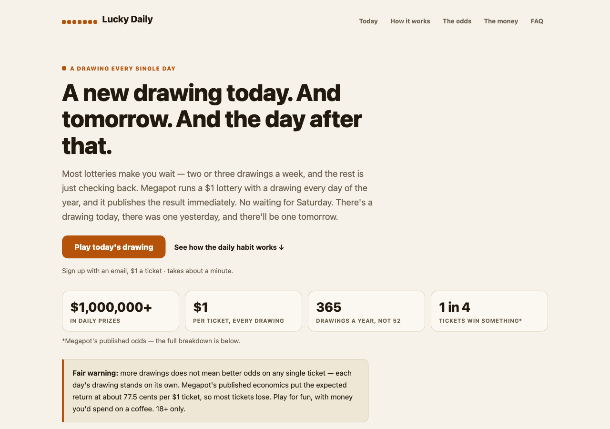
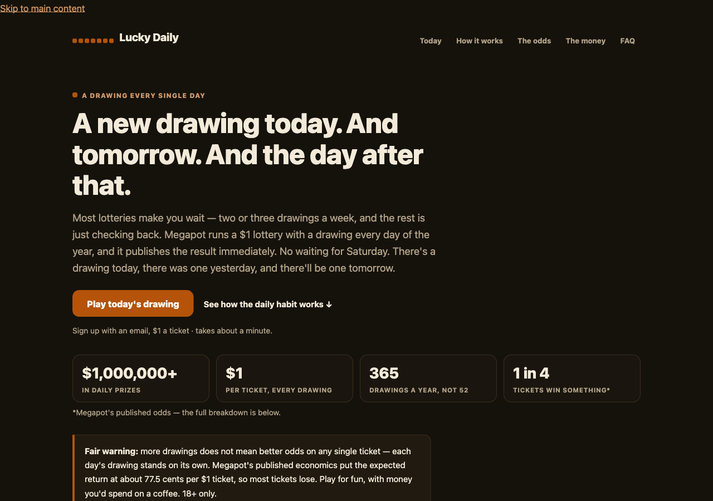

# Daily — a new drawing, every single day

A habit-driven landing page template for Megapot, the daily $1
on-chain lottery. Built around a different premise than a one-time pitch: most lotteries make
you wait for one weekly (or twice-weekly) event, but Megapot draws every single day of the
year and publishes results immediately. This template sells the *cadence* — checking in is a
small, repeatable routine, not a countdown to Saturday.

  
  

[**View the full scrolled page →**](screenshots/full-page.png)

## Why this template exists

Formal, Fun, and Degen each target a different kind of visitor, but all three pitch Megapot as
a single event worth trusting or getting excited about. None of them lean on the one structural
fact that makes Megapot different from Powerball or Mega Millions: it draws *daily*, not weekly.
Daily gives that fact its own page — calmer than Fun, warmer than Formal, and explicitly not
crypto-coded like Degen.

## Who it's for

Traffic that responds to routine and habit framing — daily-deal newsletters, habit-tracker or
productivity-adjacent audiences, or anyone for whom "there's something new today" is a better
hook than "there's a jackpot." Sans-serif, rounded, card-based UI (a "planner page" feel) rather
than Formal's editorial serif, Fun's confetti/pill motifs, or Degen's terminal aesthetic.

## What's on the page

A single scroll, structured around the daily habit:

- **Today** (hero) — leads with the daily-cadence claim, not a jackpot number; stats row +
  house-edge warning up front
- **The habit** — a seven-day "week strip" visual (every day has its own drawing, not a personal
  streak) plus an honest frequency comparison: Megapot's 365 drawings/year vs. Powerball's ~156
  (drawn 3×/week) and Mega Millions' ~104 (drawn 2×/week) — explicitly framed as "for scale," not
  as an odds claim
- **How it works** — the same four-step mechanic every template uses, reworded for the daily frame
- **The odds, printed in full** — all ten prize tiers, jackpot odds, and the guaranteed-minimum +
  premium-pool payout mechanic
- **Where the money goes** — the same 77.5% / 12.5% / 10% breakdown as every other template, in
  the template's own visual language (rounded bar, not Formal's hairline table)
- **Verify it** — the same four checkable trust claims (randomness, public record, audits,
  license) as the rest of the family
- **FAQ** in native `
` — including a direct answer to "do I have to play every day to
  win?" (no — frequency doesn't change any single ticket's odds, stated explicitly to stay inside
  the no-odds-manipulation claims rule)

Every number is sourced from Megapot's own published documentation (the same figures used across
Formal/Fun/Degen) and attributed as such; the only template-specific claims (Powerball/Mega
Millions draw schedules) are well-known public facts about those games, cited "for scale" the
same way Formal cites Powerball's jackpot odds.

## Design

Warm neutral background (`#f6f2ea` light / `#15120c` dark), a terracotta/amber accent
(`#b45309`), and rounded, card-based components — a "planner page" visual language distinct from
Formal (serif, cream, hairline rules), Fun (playful, pill-shaped, confetti), and Degen (terminal,
near-black, neon green). System sans-serif type, generous rounded corners, soft borders instead
of hard rules. Full light and dark palettes via `prefers-color-scheme`; contrast checked
programmatically in both schemes (ink/bg ≥15:1, muted/bg ≥5.5:1, CTA text/brand ≥5:1 — all clear
of the 4.5:1 AA floor).

## Technical

- Single self-contained HTML file — no build step, no external fonts, scripts, or requests
- No JavaScript. The FAQ uses native `
`/`
`
- `:focus-visible` rings, 44px minimum tap targets, semantic heading order
- Fills the repo-wide [placeholder contract](../../README.md#placeholder-contract) —
  `{{SITE_NAME}}`, `{{TAGLINE}}`, `{{THEME_VARS}}`, `{{INVITE_URL}}`, `{{DISCLAIMER}}`,
  `{{PAGE_NOTE}}`, `{{CLICK_BEACON}}`
- Wired into [megapot.build](https://megapot.build)'s wizard as the fourth selectable page style
  ("Daily"), with byte-for-byte parity tests against a committed golden output

## Use it

The easy way: [megapot.build](https://megapot.build) fills every placeholder and hands you a
ready-to-deploy zip — pick "Daily" as the page style. The manual way: copy
[`index.html`](index.html), replace the placeholders, and deploy the single file anywhere
(`vercel.com/drop` takes about ten seconds).

---

*Not affiliated with Megapot. Play responsibly, 18+. Megapot is a lottery — most tickets lose.*
