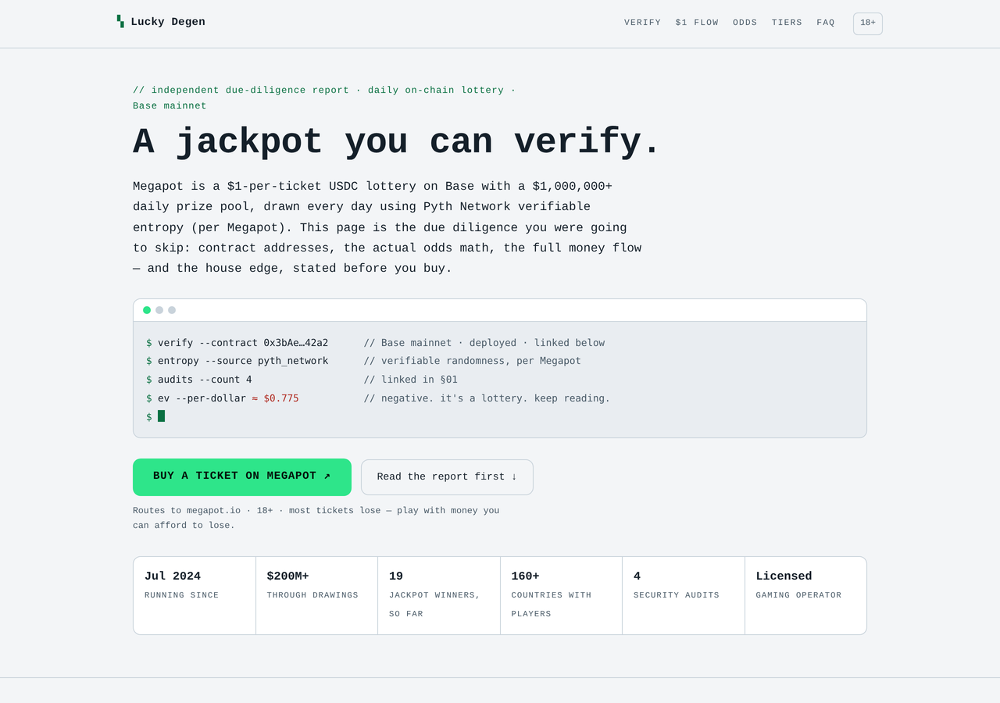

# Degen — a jackpot you can verify

A dark-first, terminal-styled landing page template for Megapot, the
daily $1 on-chain lottery on Base. Written for an audience that has been rugged, farmed, and
marketed to death, and treats every unverified claim as a lie until proven otherwise. So this
page doesn't ask for trust — it hands over the receipts.

  
  

[**View the full scrolled page (dark) →**](screenshots/full-page.png)

## Why this template exists

Crypto-native audiences don't convert on hype — they convert on data they can check themselves.
This template is structured like a due-diligence report: verifiable contract addresses, real
odds arithmetic, the full money flow, and the expected value stated as a plain number,
front and center, before anyone is asked to click anything.

## Who it's for

Base and DeFi audiences, on-chain communities, and anyone whose followers will actually click
through to BaseScan before they click "buy." Full blockchain vocabulary is fair game here —
Base, USDC, ERC-721 tickets, Pyth entropy — because this audience isn't confused by it, they're
reassured by it.

## What's on the page

Eight numbered sections (`§01`–`§08`), styled like a terminal, structured like a report:

- **Verify, don't trust** — the Jackpot contract and the ticket NFT contract, both linked
  directly to BaseScan, plus the audit trail and the Pyth entropy source
- **The $1 flow** — where every dollar actually goes, with **expected value (≈ $0.775 per $1
  ticket) shown as the single largest number on the page** — not a footnote, the headline
- **The odds, shown as math** — the actual combinatorics (5-of-30 ≈ 1 in 142,506), the dynamic
  bonusball range explained, and the 205×-better-than-Powerball comparison
- **The full 12-combination tier table** — including the two combinations that pay nothing,
  struck through, because a report that only shows the good outcomes isn't a report
- **The unique-numbers alpha** — how avoiding duplicate picks can mean a bigger share of the
  premium pool (it changes your payout, never your odds — the page says so)
- **Full disclosure** — this is an independent referral front-end; it never touches funds;
  purchases execute directly against Megapot's contract
- **An adversarial FAQ** — the sharp questions this audience actually asks ("can the team see
  the numbers early?" "is this +EV?" — no, and the page says so in the first screen)

## Design

Dark-first monospace terminal aesthetic (a full light palette ships too, via
`prefers-color-scheme`) — data tables, a blinking-cursor hero, and a rug-check card built to be
screenshotted and shared on its own. `--brand` drives chrome only, never body text, so an
operator's color never breaks a contrast pairing.

## Technical

- Single self-contained HTML file — no build step, no external fonts, scripts, or requests
- No JavaScript, including the terminal cursor blink (CSS `@keyframes`, reduced-motion safe)
- `:focus-visible` rings derived via `color-mix()` so they stay visible against any injected
  brand color, in both schemes
- 44px minimum tap targets, semantic heading order
- ~23 KB
- Fills the repo-wide [placeholder contract](../../README.md#placeholder-contract) —
  `{{SITE_NAME}}`, `{{TAGLINE}}`, `{{THEME_VARS}}`, `{{INVITE_URL}}`, `{{DISCLAIMER}}`,
  `{{PAGE_NOTE}}`, `{{CLICK_BEACON}}`

## Use it

The easy way: [megapot.build](https://megapot.build) fills every placeholder and hands you a
ready-to-deploy zip — pick "Degen" as the page style. The manual way: copy
[`index.html`](index.html), replace the placeholders, and deploy the single file anywhere
(`vercel.com/drop` takes about ten seconds).

---

*Not affiliated with Megapot. Play responsibly, 18+. It's -EV — that's stated on the page, not
hidden. Megapot is a lottery — most tickets lose.*
