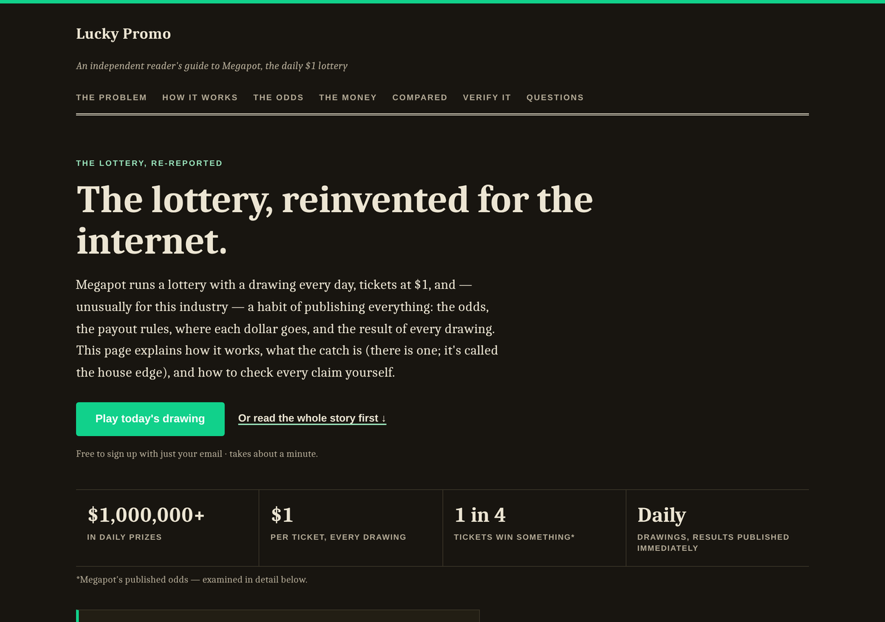

# Formal — an independent reader's guide to Megapot

A long-form, editorial landing page template for Megapot, the daily $1
on-chain lottery. Built for the audience most lottery-referral pages ignore: normal, skeptical
web users who have never held crypto and don't intend to start — they just want to know if a
"$1,000,000+ daily prize pool" claim is real before they hand over a dollar.

  
  

[**View the full scrolled page →**](screenshots/full-page.png)

## Why this template exists

Most crypto-adjacent landing pages read like a pitch deck: bold claims, no sourcing, a button.
That approach converts crypto natives who already trust the rails. It does nothing for someone
who Googled "is Megapot legit" five minutes ago. This template is written like a piece of
consumer journalism — it makes the case for a $1 lottery ticket the way a good explainer
article would, with the skepticism built in rather than argued against.

## Who it's for

Use this template if your traffic is mostly non-crypto: email newsletters, personal finance
communities, general-interest social audiences, or anyone who converts better on trust than on
hype. There is **zero blockchain vocabulary** anywhere on the page — no "wallet," "on-chain,"
"USDC," or "crypto." Signing up is framed the way it actually works for this audience: an email
address and about a minute.

## What's on the page

A single scroll, structured like a magazine feature:

- **The problem** — what's actually wrong with the lottery you grew up with (traditional
  operators keep up to 70% of every ticket; Megapot returns roughly 77.5%)
- **How it works** — four steps, plain language, no jargon
- **The odds, printed in full** — all ten prize tiers, not just the jackpot, plus the honest
  mechanic of how the guaranteed-minimum and premium-pool payouts are calculated
- **Where the money actually goes** — a dollar-by-dollar breakdown (prizes / backers /
  referrers), including the part most pages bury: there's a house edge, stated plainly
- **A comparison table** against traditional lotteries — payout speed, transparency, revenue
  share, accessibility
- **How do I know it's not rigged?** — checkable claims: audits, verifiable randomness, a public
  results page
- **A skeptic's FAQ** in native `
` — the questions a smart reader actually has
- A closing call to action, and a footer disclaimer that never gets buried

Every number on the page is sourced from Megapot's own published documentation and attributed
as such — this template makes a case, it doesn't invent one.

## Design

Serif display type (a Charter/Georgia stack), a warm paper background, hairline rules, and a
"double border" masthead — the visual language of a broadsheet explainer, not a SaaS landing
page. Full light and dark palettes via `prefers-color-scheme`; every text/background pairing is
WCAG AA (≥4.5:1), verified programmatically in both schemes.

## Technical

- Single self-contained HTML file — no build step, no external fonts, scripts, or requests
- No JavaScript. The FAQ uses native `
`/`
`
- `:focus-visible` rings, 44px minimum tap targets, semantic heading order
- ~22 KB
- Fills the repo-wide [placeholder contract](../../README.md#placeholder-contract) —
  `{{SITE_NAME}}`, `{{TAGLINE}}`, `{{THEME_VARS}}`, `{{INVITE_URL}}`, `{{DISCLAIMER}}`,
  `{{PAGE_NOTE}}`, `{{CLICK_BEACON}}`

## Use it

The easy way: [megapot.build](https://megapot.build) fills every placeholder and hands you a
ready-to-deploy zip — pick "Formal" as the page style. The manual way: copy
[`index.html`](index.html), replace the placeholders, and deploy the single file anywhere
(`vercel.com/drop` takes about ten seconds).

---

*Not affiliated with Megapot. Play responsibly, 18+. Megapot is a lottery — most tickets lose.*
