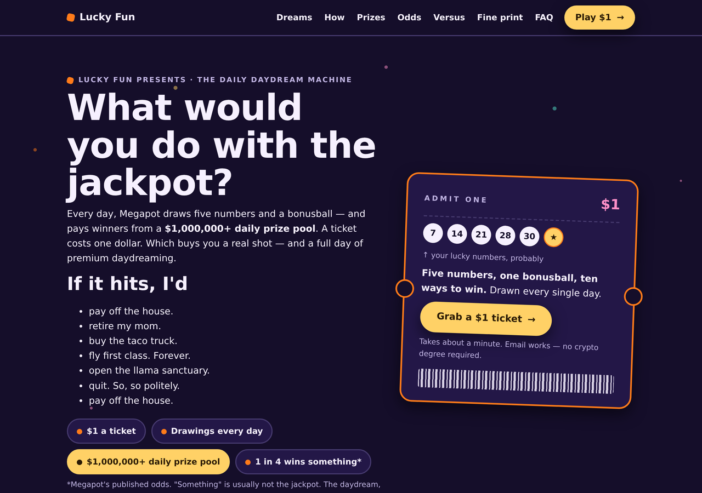

# Fun — the daily daydream machine

A game-show-energy landing page template for Megapot, the daily $1
on-chain lottery. This one doesn't try to convince anyone with a spreadsheet — it sells the
feeling. A dollar buys a real shot at a $1,000,000+ prize pool, and for one glorious second
before the drawing, it also buys the daydream. That's the product this page sells.

  
  

[**View the full scrolled page →**](screenshots/full-page.png)

## Why this template exists

Most people don't decide to play a lottery by reading a comparison table — they decide because
for a second they pictured what winning would feel like. This template leads with that feeling
and never lets go of it, while keeping every fact on the page honest, sourced, and never
oversold. The jokes never lie; the odds are always Megapot's real, published numbers.

## Who it's for

Social, community, and creator audiences — the everyday dreamer, not the spreadsheet skeptic
and not the on-chain native. If your traffic responds to color, motion, and a bit of delight
more than it responds to due diligence, this is the template. It's crypto-adjacent but not
crypto-heavy: a couple of incidental mentions, never the headline.

## What's on the page

A scroll built like a ten-round game show, not a wall of text:

- **Daydreams** — a CSS-only rotating headline ("If it hits, I'd… pay off the house / retire
  my mom / open the llama sanctuary") plus a punched, barcoded ticket-stub illustration
- **A cold open** — a short vignette that grounds the fantasy in what actually happens on drawing
  night
- **How it works** in ten seconds flat
- **The prize ladder** — all ten winning tiers presented as a game board, not a spreadsheet
- **The Odds-O-Meter** — the real math (1 in 4 wins *something*, ~205× better than Powerball),
  played straight even while it's playful
- **A candy-striped dollar breakdown** — where the $1 actually goes, presented honestly
- **Versus the gas-station ticket** — a quick, accurate comparison
- **Receipts** — the track record (running since July 2024, $200M+ through drawings, audited,
  backed by Dragonfly and Coinbase Ventures)
- **A FAQ with a sense of humor** that never gets a fact wrong

The honesty is written in as a feature, not a disclaimer bolted on at the end: "most tickets
lose — the daydream never does."

## Design

Warm cream-and-confetti light palette, deep dusk purple in dark mode (auto via
`prefers-color-scheme`), rounded display type, and a hand-drawn ticket-stub motif built entirely
in CSS — no images, no icon fonts. The rotating headline is a pure CSS keyframe animation with a
full `prefers-reduced-motion` fallback and a static, screen-reader-friendly version underneath.

## Technical

- Single self-contained HTML file — no build step, no external fonts, scripts, or requests
- No JavaScript, including the headline animation (CSS `@keyframes` only)
- Motion fully gated behind `prefers-reduced-motion: no-preference`
- `:focus-visible` rings, 44px minimum tap targets
- ~33 KB
- Fills the repo-wide [placeholder contract](../../README.md#placeholder-contract) —
  `{{SITE_NAME}}`, `{{TAGLINE}}`, `{{THEME_VARS}}`, `{{INVITE_URL}}`, `{{DISCLAIMER}}`,
  `{{PAGE_NOTE}}`, `{{CLICK_BEACON}}`

## Use it

The easy way: [megapot.build](https://megapot.build) fills every placeholder and hands you a
ready-to-deploy zip — pick "Fun" as the page style. The manual way: copy
[`index.html`](index.html), replace the placeholders, and deploy the single file anywhere
(`vercel.com/drop` takes about ten seconds).

---

*Not affiliated with Megapot. Play responsibly, 18+. Megapot is a lottery — most tickets lose.*
